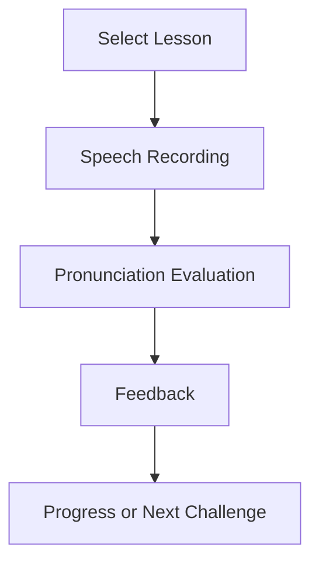
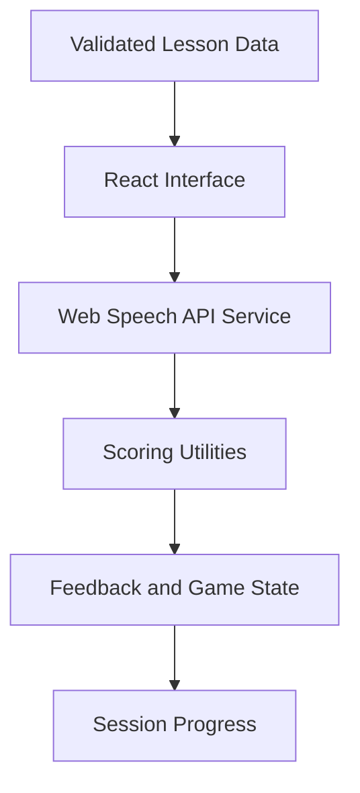

# SpeakFall

Voice-powered English practice with pronunciation feedback and interactive gameplay.

[](https://github.com/kbyunghak/SpeakFall/actions/workflows/ci.yml)
[](https://kbyunghak.github.io/SpeakFall/)

## Overview

SpeakFall is a browser-based English learning application that combines sentence
practice, word-level pronunciation feedback, and a voice-controlled falling-word
challenge.

**Project Type:** Language Learning Web Application

> **Speak. Score. Improve.**

## Live Demo

[Open SpeakFall](https://kbyunghak.github.io/SpeakFall/)

A microphone and speech-recognition permission are required. A modern
Chromium-based browser provides the most consistent Web Speech API support.

## Problem

Language learners need repeated speaking practice and immediate feedback, but
traditional vocabulary tools often focus on reading or multiple-choice recall.
Human pronunciation coaching is also not always available for short, frequent
practice sessions.

## Solution

SpeakFall uses browser speech recognition to compare spoken input with target
sentences, identify matched and missed words, calculate practice feedback, and
reinforce vocabulary through a fast-paced voice game.

## Key Features

- English sentence practice at multiple difficulty levels.
- Word-by-word comparison between recognized and target speech.
- Pronunciation accuracy and missed-word feedback.
- Voice-controlled falling-word vocabulary challenge.
- Score, level, lives, correct-word, and missed-word tracking.
- Curated pronunciation-learning resources.
- Automated validation for sentence and vocabulary data.
- Responsive GitHub Pages deployment.

## How It Works

### Learning Flow



1. Select a sentence level or vocabulary challenge.
2. Grant microphone access and speak the displayed content.
3. The Web Speech API returns recognized text.
4. Framework-independent scoring utilities compare words in order.
5. The interface displays accuracy, missed words, and game progress.

## Architecture



React components manage presentation and state composition. Browser APIs are
isolated in `services/`, while scoring and game calculations remain in `utils/`
for direct testing.

## Tech Stack

| Area | Technology |
| --- | --- |
| UI | React 19 |
| Build | Vite |
| Speech | Web Speech API |
| Testing | Vitest, React Testing Library, coverage-v8 |
| Data | Validated JSON sentence and vocabulary content |
| Delivery | GitHub Actions, GitHub Pages |

## Project Structure

```text
SpeakFall/
├── src/
│   ├── components/    Shared UI and layout components
│   ├── data/          Sentence and vocabulary data
│   ├── pages/         Home, resources, sentence, and vocabulary games
│   ├── services/      Web Speech API integration
│   ├── utils/         Pronunciation and game calculations
│   ├── App.jsx        Routes and application composition
│   └── App.test.jsx   Application integration tests
├── scripts/           Data validation
├── public/            Static assets
└── README.md
```

## Current Status

- Public GitHub Pages application is available.
- Sentence practice, speech recognition, word comparison, and feedback are working.
- The falling-word voice game and score tracking are implemented.
- CI validates tests, coverage, learning data, and the production build.
- Pronunciation scoring is intentionally lightweight and remains an improvement area.

## Getting Started

Requirements: Node.js 20 or later, npm, a microphone, and a supported browser.

```bash
git clone https://github.com/kbyunghak/SpeakFall.git
cd SpeakFall
npm ci
npm start
```

The development server uses `http://localhost:5173` by default.

Create and preview a production build:

```bash
npm run build
npm run preview
```

## Testing

```bash
npm test
npm run test:ci
npm run data:validate
npm run build
```

The CI test command generates coverage, while data validation checks that required
categories contain valid, unique learning content.

## CI/CD

For pushes and pull requests targeting `main` or `master`, the CI workflow installs
dependencies, runs tests with coverage, validates learning data, and creates a
production build. The deployment workflow repeats the quality checks and publishes
`dist/` to GitHub Pages.

## Documentation

- [Contributing and Commit Guidelines](CONTRIBUTING.md)
- [Shared README Standard](https://github.com/kbyunghak/Portfolio/blob/master/docs/README_STANDARD.md)
- [Shared Commit Standard](https://github.com/kbyunghak/Portfolio/blob/master/docs/COMMIT_STANDARD.md)

## Roadmap

- Review sentence content for grammar and natural phrasing.
- Improve the pronunciation comparison algorithm.
- Expand page-level component test coverage.
- Improve accessibility and mobile layouts.
- Add browser automation for complete voice-game flows.

## Limitations

- Recognition accuracy depends on browser support, microphone quality, and noise.
- Some Web Speech API features are limited in Safari and Firefox.
- Sentence scoring currently uses ordered word matching rather than phoneme analysis.
- Microphone permission is required for core speech features.

## License

No license file is currently provided. All rights are reserved unless a license is
added explicitly.
